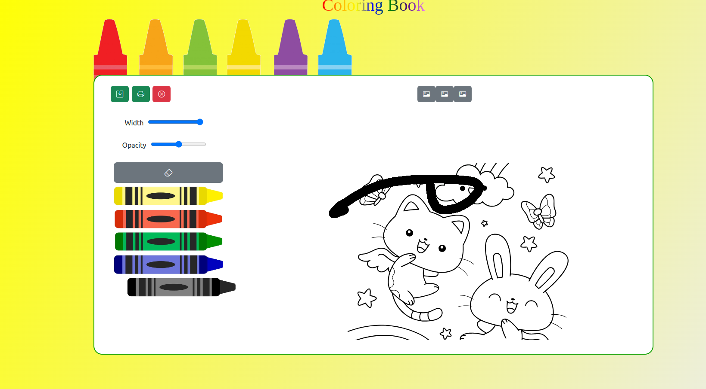

### Coloring book

## Available Scripts

In the project directory, you can run:

### `yarn start`

Runs the app in the development mode.\
Open [http://localhost:3000](http://localhost:3000) to view it in the browser.

### Repo Available @
[https://github.com/bojanseirovski/coloring.github.io](https://github.com/bojanseirovski/coloring.github.io)

### Github hosted page @
[https://bojanseirovski.github.io/](https://bojanseirovski.github.io/)

